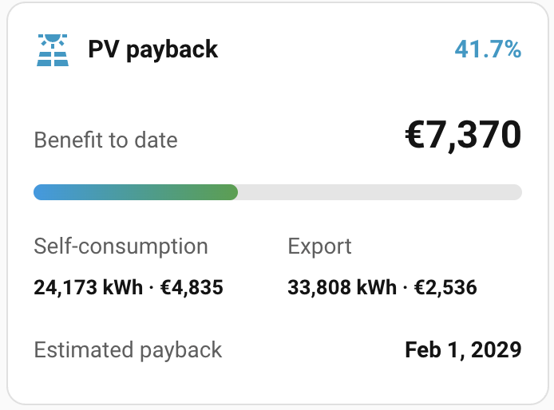
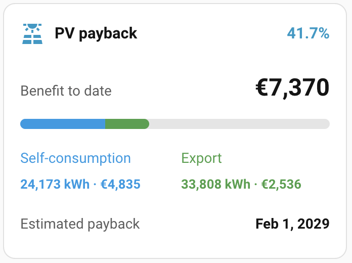

# PV Payback Card

[](https://hacs.xyz)
[](LICENSE)
[](https://github.com/yas4891/pv-payback-card/actions/workflows/validate.yml)

PV Payback Card is a custom Lovelace card for [Home Assistant](https://www.home-assistant.io/). It estimates when a photovoltaic installation reaches payback from cumulative self-consumption and grid-export energy.

The card calculates the financial benefit directly in the browser. It needs no companion integration and no vendor-specific inverter integration. Configure cumulative production and export energy entities, or a direct self-consumption entity when available.

The card accepts `Wh`, `kWh`, and `MWh` sensors. It also preserves the latest valid reading during a temporary overnight `unknown` or `unavailable` state.

## Screenshots

### Standard progress bar



### Separate self-consumption and export contributions



## Features

- Configurable start date, investment cost, electricity price, and feed-in tariff.
- Cumulative production and export-energy entities, or a direct self-consumption entity, chosen in the visual editor.
- Payback forecast from the observed average financial benefit since the start date.
- Optional location-aware seasonal forecast, calculated locally from the Home Assistant location.
- Optional baseline values for counters that started before the accounting period.
- Optional energy and monetary values in the detailed breakdown.
- Optional blue and green contribution segments with clickable source-entity details.
- Cached last valid readings and visible warnings for unavailable or decreasing counters.
- Localized German and English output.
- Responsive layout for desktop and mobile dashboards.

## Installation

### Via HACS

This repository is currently installed as a HACS custom repository.

[](https://my.home-assistant.io/redirect/hacs_repository/?owner=yas4891&repository=pv-payback-card&category=plugin)

1. Select the button above from a device that can open your Home Assistant instance.
2. Confirm the custom repository as type **Dashboard**.
3. Open HACS, select **PV Payback Card**, and choose **Download**.
4. Reload the browser when HACS finishes.
5. Add the card through the dashboard editor and configure its entities.

HACS usually registers the dashboard resource automatically. Add the following resource manually only when Home Assistant does not load the card:

```yaml
url: /hacsfiles/pv-payback-card/pv-payback-card.js
type: module
```

### Manual installation

1. Download `dist/pv-payback-card.js` from this repository.
2. Copy it to `config/www/pv-payback-card/pv-payback-card.js`.
3. Register the following Home Assistant dashboard resource.

```yaml
url: /local/pv-payback-card/pv-payback-card.js
type: module
```

4. Reload the browser and add `custom:pv-payback-card` in the dashboard editor.

## Quick configuration

```yaml
type: custom:pv-payback-card
name: PV payback
start_date: "2024-12-01"
investment_cost: 17653.06
electricity_price: 0.20
feed_in_tariff: 0.075
production_energy_entity: sensor.pv_production_total
export_energy_entity: sensor.pv_export_total
use_location_seasonality: true
annual_discount_rate: 3.5
use_historical_statistics: true
```

The card calculates self-consumption as production minus export. The card uses cumulative energy values, not current power values.
When enabled, valid Home Assistant coordinates confirm the location. The latitude determines the seasonal curve. No location fields are required in the card configuration.

## Energy input models

Use `production_energy_entity` and `export_energy_entity` for most installations. The card calculates self-consumption as production minus export.

Alternatively, configure `self_consumption_entity` and `export_energy_entity`. A configured direct self-consumption entity always takes priority over the production-based calculation.

### Combining several energy sources

See [Combining production from multiple inverters](https://github.com/yas4891/pv-payback-card/wiki/Combining-production-from-multiple-inverters) for a generic Template helper workflow and a concrete two-inverter example.

## Configuration options

| Option                       | Required | Default                   | Description and example                                                                                                                                                                                                                                                                          |
| ---------------------------- | -------- | ------------------------- | ------------------------------------------------------------------------------------------------------------------------------------------------------------------------------------------------------------------------------------------------------------------------------------------------ |
| `start_date`                 | Yes      | —                         | Installation or accounting start date in `YYYY-MM-DD` format. Example: `"2024-12-01"`. The forecast uses the average benefit since this date.                                                                                                                                                    |
| `investment_cost`            | Yes      | —                         | Net investment cost after grants, entered as a number without a currency symbol or thousands separator. Example: `17653.06`.                                                                                                                                                                     |
| `electricity_price`          | Yes      | —                         | Value of one self-consumed `kWh`, in the selected currency. Use a decimal point, never a comma. Example: `0.2` means EUR/USD 0.20 per `kWh`; `0,2` is not valid. This fixed value applies to the complete selected accounting period.                                                            |
| `feed_in_tariff`             | Yes      | —                         | Remuneration for one exported `kWh`, in the selected currency. Use a decimal point, never a comma. Example: `0.075` means EUR/USD 0.075 per `kWh`; `0,075` is not valid. This fixed value applies to the complete selected accounting period.                                                    |
| `self_consumption_entity`    | No       | —                         | Entity with total self-consumed PV energy. It has priority over `production_energy_entity`. Configure this entity or `production_energy_entity`. The entity must expose a cumulative numeric value in `Wh`, `kWh`, or `MWh`. Example: `sensor.pv_self_consumption_total`.                        |
| `production_energy_entity`   | No       | —                         | Entity with total PV production energy. Configure this entity when no direct self-consumption entity exists. The card calculates self-consumption as production minus export. The entity must expose a cumulative numeric value in `Wh`, `kWh`, or `MWh`. Example: `sensor.pv_production_total`. |
| `export_energy_entity`       | Yes      | —                         | Entity with total energy exported to the grid. The entity must expose a cumulative numeric value in `Wh`, `kWh`, or `MWh`. Example: `sensor.pv_export_total`.                                                                                                                                    |
| `self_consumption_baseline`  | No       | `0`                       | Self-consumption counter reading at `start_date`, in `kWh`. Use it when the selected counter began before the accounting period. Example: `1250.4`.                                                                                                                                              |
| `export_energy_baseline`     | No       | `0`                       | Export counter reading at `start_date`, in `kWh`. Use it when the selected counter began before the accounting period. Example: `830.7`.                                                                                                                                                         |
| `name`                       | No       | Localized title           | Card heading. Example: `"PV payback"`.                                                                                                                                                                                                                                                           |
| `icon`                       | No       | `mdi:solar-power-variant` | Material Design icon in the card heading. Example: `mdi:solar-power-variant`.                                                                                                                                                                                                                    |
| `currency`                   | No       | Home Assistant currency   | ISO 4217 currency code for displayed monetary values. Example: `EUR`, `USD`, or `GBP`.                                                                                                                                                                                                           |
| `locale`                     | No       | Home Assistant language   | Language and number format override. Example: `de-DE` or `en-US`. German and English card texts are included.                                                                                                                                                                                    |
| `show_breakdown`             | No       | `true`                    | Shows separate self-consumption and export values. Set `false` for a smaller card.                                                                                                                                                                                                               |
| `show_energy_values`         | No       | `true`                    | Shows cumulative self-consumption and export energy in `kWh`. The card rounds displayed energy values to whole `kWh`. Set `false` to hide energy values.                                                                                                                                         |
| `show_money_values`          | No       | `true`                    | Shows the calculated monetary value for self-consumption and export. Set `false` to hide these monetary values from the breakdown.                                                                                                                                                               |
| `show_payback_date`          | No       | `true`                    | Shows the estimated payback date. Set `false` when only the progress is needed.                                                                                                                                                                                                                  |
| `show_progress`              | No       | `true`                    | Shows the percentage and progress bar. Set `false` when the financial value is sufficient.                                                                                                                                                                                                       |
| `show_contribution_segments` | No       | `false`                   | Shows self-consumption as a blue segment and export as a green segment in the progress bar. The corresponding breakdown values use the same colors and open source details when clicked.                                                                                                         |
| `use_location_seasonality`   | No       | `false`                   | Uses a local seasonal solar-potential forecast after valid Home Assistant coordinates confirm the location. The latitude determines the seasonal curve. The card uses the existing linear forecast when the location is missing or invalid.                                                      |
| `annual_discount_rate`       | No       | `0`                       | Annual discount rate as a percentage. Example: `3.5` means 3.5% per year. `0` preserves the existing nominal calculation.                                                                                                                                                                        |
| `use_historical_statistics`  | No       | `false`                   | Uses Home Assistant daily recorder statistics to place past discounted cashflows on their actual days. This option only applies with a positive `annual_discount_rate`.                                                                                                                          |

## Calculation and data availability

The card calculates the benefit as self-consumed energy times `electricity_price`, plus exported energy times `feed_in_tariff`. With production input, self-consumed energy equals production minus export. It projects the payback date from the average benefit since `start_date`.

When `use_location_seasonality` is `true`, the card estimates daily solar potential from the Home Assistant latitude. It converts observed benefit per accumulated solar potential into future daily benefit. This calculation runs locally and makes no network requests. The card uses the linear forecast when the option is disabled, coordinates are unavailable or invalid, or a seasonal result cannot be calculated.

Set `annual_discount_rate` as a percentage, not a fraction. The card discounts each daily cashflow from `start_date` using 365.2425 days per year. A positive rate can delay payback. It can also make payback impossible within the forecast limit.

With `use_historical_statistics: true`, the card requests only daily `sum` statistics through Home Assistant's recorder WebSocket API. It never requests raw history. The browser shares one successful or failed request per source, start date, and completed end date during its session. The card renders immediately with an even daily approximation. It updates once when recorder data arrives. Missing statistics, an unavailable recorder, or a failed request keep the approximation active. Recorder retention and enabled statistics can limit available historical days.

During a temporary `unknown` or `unavailable` state, the card uses the latest valid browser-stored reading. It visibly marks cached data and never treats a missing value as zero.

If a cumulative counter briefly reports a lower value, the card keeps the higher cached value. It displays a localized warning that names the affected entity. Changing the selected input model, entities, date, or baselines starts a separate cache scope.

The seasonal estimate assumes a constant self-consumption share. It does not model weather, shading, tariff changes, maintenance, financing, or degradation. Use a helper that calculates cumulative monetary benefit when those assumptions need a more detailed model.

## Development

```sh
npm ci
npm run format:check
npm run lint
npm test
npm run build
```
